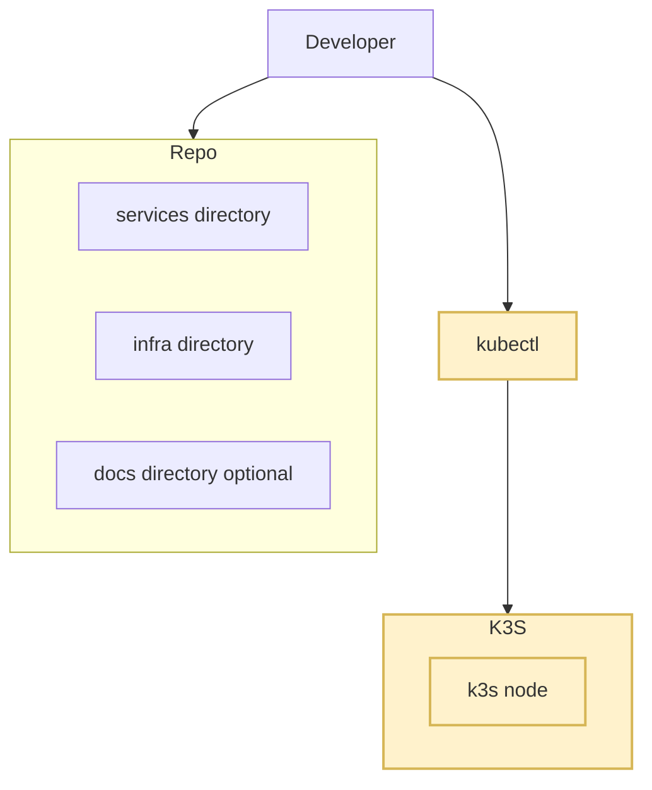

```mermaid  
    flowchart TB
    classDef new fill:#fff2cc,stroke:#d6b656,stroke-width:2px;

    Dev["Developer"] --> Repo["Monorepo ecommerce k3s microservices"]
    Dev --> Kubectl["kubectl"]

    subgraph Repo
        Services["services directory"]
        Infra["infra directory"]
        Docs["docs directory optional"]
    end

    Kubectl --> K3S["k3s cluster"]
    subgraph K3S
        Node1["k3s node"]
    end

    class Kubectl,K3S,Node1 new;
```