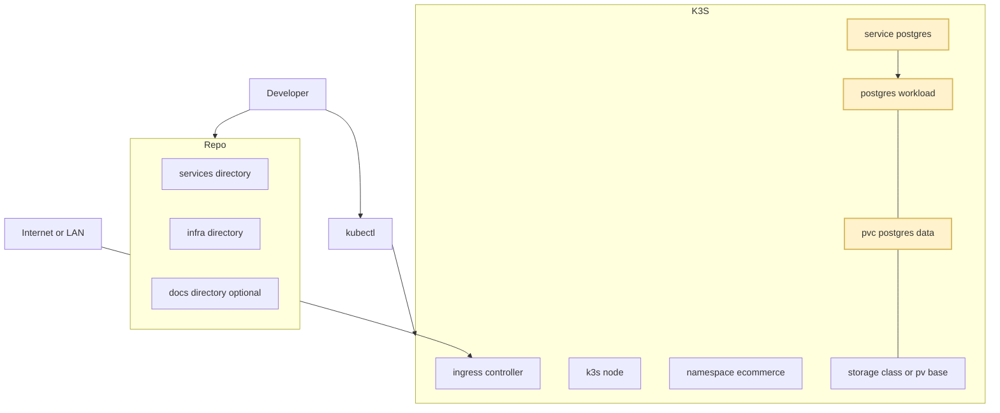

```mermaid
    flowchart TB
    classDef new fill:#fff2cc,stroke:#d6b656,stroke-width:2px;

    Dev["Developer"] --> Repo["Monorepo ecommerce k3s microservices"]
    Dev --> Kubectl["kubectl"]
    Internet["Internet or LAN"] --> IngressCtrl

    subgraph Repo
        Services["services directory"]
        Infra["infra directory"]
        Docs["docs directory optional"]
    end

    Kubectl --> K3S["k3s cluster"]
    subgraph K3S
        Node1["k3s node"]
        NSE["namespace ecommerce"]
        IngressCtrl["ingress controller"]
        Storage["storage class or pv base"]

        PgSvc["service postgres"]
        PgPod["postgres workload"]
        PgPvc["pvc postgres data"]
    end

    PgSvc --> PgPod
    PgPod --- PgPvc
    PgPvc --- Storage

    class PgSvc,PgPod,PgPvc new;
```