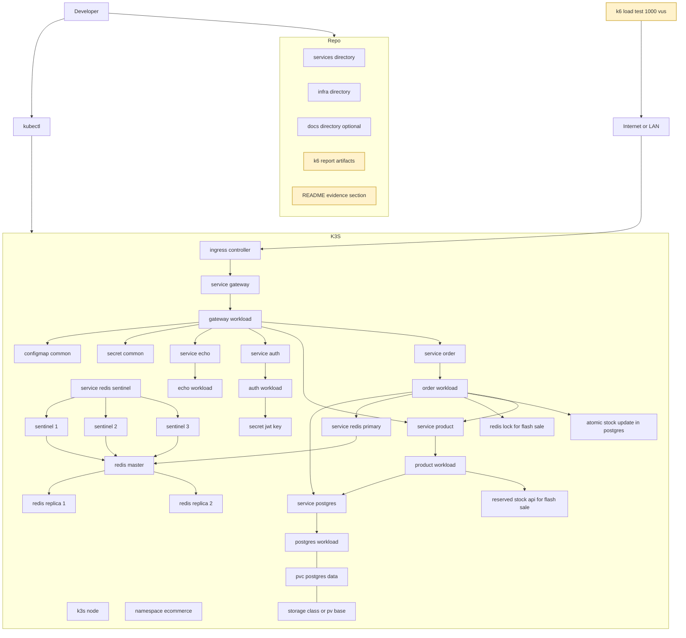

```mermaid
    flowchart TB
    classDef new fill:#fff2cc,stroke:#d6b656,stroke-width:2px;

    Dev["Developer"] --> Repo["Monorepo ecommerce k3s microservices"]
    Dev --> Kubectl["kubectl"]

    K6["k6 load test 1000 vus"] --> Internet["Internet or LAN"]

    subgraph Repo
        Services["services directory"]
        Infra["infra directory"]
        Docs["docs directory optional"]
        Report["k6 report artifacts"]
        Readme["README evidence section"]
    end

    Internet --> IngressCtrl

    Kubectl --> K3S["k3s cluster"]
    subgraph K3S
        Node1["k3s node"]
        NSE["namespace ecommerce"]
        IngressCtrl["ingress controller"]
        Storage["storage class or pv base"]

        PgSvc["service postgres"]
        PgPod["postgres workload"]
        PgPvc["pvc postgres data"]

        RedisSvc["service redis primary"]
        SentinelSvc["service redis sentinel"]

        RedisMaster["redis master"]
        RedisReplica1["redis replica 1"]
        RedisReplica2["redis replica 2"]

        Sentinel1["sentinel 1"]
        Sentinel2["sentinel 2"]
        Sentinel3["sentinel 3"]

        CommonCM["configmap common"]
        CommonSecret["secret common"]

        GwSvc["service gateway"]
        GwPod["gateway workload"]

        EchoSvc["service echo"]
        EchoPod["echo workload"]

        AuthSvc["service auth"]
        AuthPod["auth workload"]
        JwtSecret["secret jwt key"]

        ProductSvc["service product"]
        ProductPod["product workload"]
        StockApi["reserved stock api for flash sale"]

        OrderSvc["service order"]
        OrderPod["order workload"]
        RedisLock["redis lock for flash sale"]
        AtomicStock["atomic stock update in postgres"]
    end

    PgSvc --> PgPod
    PgPod --- PgPvc
    PgPvc --- Storage

    RedisMaster --> RedisReplica1
    RedisMaster --> RedisReplica2

    RedisSvc --> RedisMaster
    SentinelSvc --> Sentinel1
    SentinelSvc --> Sentinel2
    SentinelSvc --> Sentinel3

    Sentinel1 --> RedisMaster
    Sentinel2 --> RedisMaster
    Sentinel3 --> RedisMaster

    IngressCtrl --> GwSvc
    GwSvc --> GwPod

    GwPod --> CommonCM
    GwPod --> CommonSecret

    EchoSvc --> EchoPod
    GwPod --> EchoSvc

    AuthSvc --> AuthPod
    GwPod --> AuthSvc
    AuthPod --> JwtSecret

    ProductSvc --> ProductPod
    GwPod --> ProductSvc
    ProductPod --> PgSvc
    ProductPod --> StockApi

    OrderSvc --> OrderPod
    GwPod --> OrderSvc
    OrderPod --> PgSvc
    OrderPod --> RedisSvc
    OrderPod --> RedisLock
    OrderPod --> AtomicStock
    OrderPod --> ProductSvc

    class K6,Report,Readme new;
```