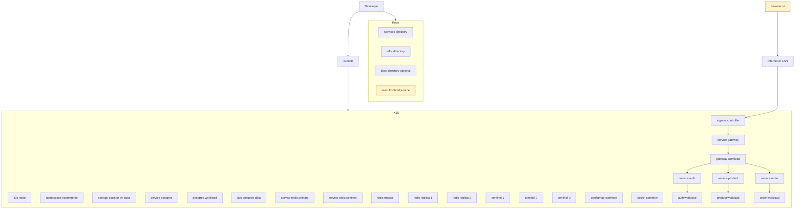

```mermaid
    flowchart TB
    classDef new fill:#fff2cc,stroke:#d6b656,stroke-width:2px;

    Dev["Developer"] --> Repo["Monorepo ecommerce k3s microservices"]
    Dev --> Kubectl["kubectl"]

    Browser["browser ui"] --> Internet["Internet or LAN"]
    Internet --> IngressCtrl

    subgraph Repo
        Services["services directory"]
        Infra["infra directory"]
        Docs["docs directory optional"]
        FrontendCode["react frontend source"]
    end

    Kubectl --> K3S["k3s cluster"]
    subgraph K3S
        Node1["k3s node"]
        NSE["namespace ecommerce"]
        IngressCtrl["ingress controller"]
        Storage["storage class or pv base"]

        PgSvc["service postgres"]
        PgPod["postgres workload"]
        PgPvc["pvc postgres data"]

        RedisSvc["service redis primary"]
        SentinelSvc["service redis sentinel"]

        RedisMaster["redis master"]
        RedisReplica1["redis replica 1"]
        RedisReplica2["redis replica 2"]

        Sentinel1["sentinel 1"]
        Sentinel2["sentinel 2"]
        Sentinel3["sentinel 3"]

        CommonCM["configmap common"]
        CommonSecret["secret common"]

        GwSvc["service gateway"]
        GwPod["gateway workload"]

        AuthSvc["service auth"]
        AuthPod["auth workload"]

        ProductSvc["service product"]
        ProductPod["product workload"]

        OrderSvc["service order"]
        OrderPod["order workload"]
    end

    IngressCtrl --> GwSvc
    GwSvc --> GwPod

    GwPod --> AuthSvc
    AuthSvc --> AuthPod

    GwPod --> ProductSvc
    ProductSvc --> ProductPod

    GwPod --> OrderSvc
    OrderSvc --> OrderPod

    class Browser,FrontendCode new;
```