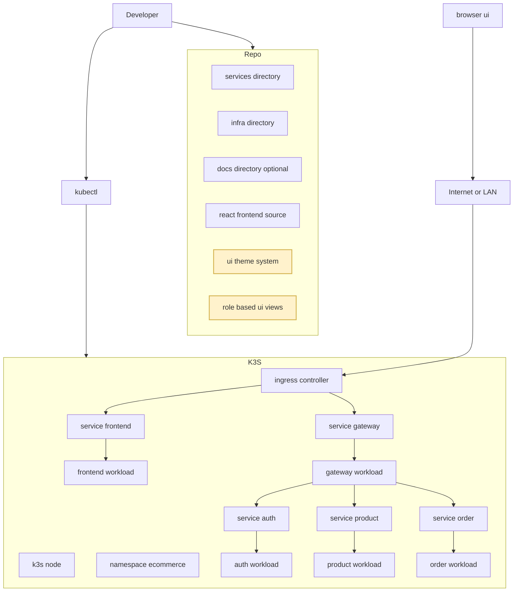

```mermaid
    flowchart TB
    classDef new fill:#fff2cc,stroke:#d6b656,stroke-width:2px;

    Dev["Developer"] --> Repo["Monorepo ecommerce k3s microservices"]
    Dev --> Kubectl["kubectl"]

    Browser["browser ui"] --> Internet["Internet or LAN"]
    Internet --> IngressCtrl

    subgraph Repo
        Services["services directory"]
        Infra["infra directory"]
        Docs["docs directory optional"]
        FrontendCode["react frontend source"]
        UITheme["ui theme system"]
        RoleUI["role based ui views"]
    end

    Kubectl --> K3S["k3s cluster"]
    subgraph K3S
        Node1["k3s node"]
        NSE["namespace ecommerce"]
        IngressCtrl["ingress controller"]

        FeSvc["service frontend"]
        FePod["frontend workload"]

        GwSvc["service gateway"]
        GwPod["gateway workload"]

        AuthSvc["service auth"]
        AuthPod["auth workload"]

        ProductSvc["service product"]
        ProductPod["product workload"]

        OrderSvc["service order"]
        OrderPod["order workload"]
    end

    IngressCtrl --> FeSvc
    FeSvc --> FePod

    IngressCtrl --> GwSvc
    GwSvc --> GwPod

    GwPod --> AuthSvc
    AuthSvc --> AuthPod

    GwPod --> ProductSvc
    ProductSvc --> ProductPod

    GwPod --> OrderSvc
    OrderSvc --> OrderPod

    class UITheme,RoleUI new;
```